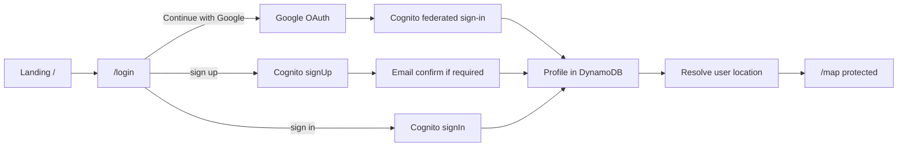
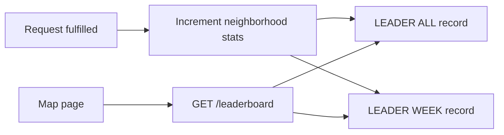
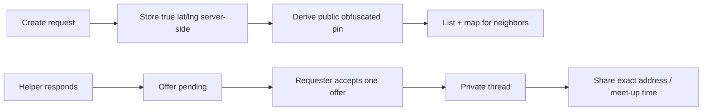
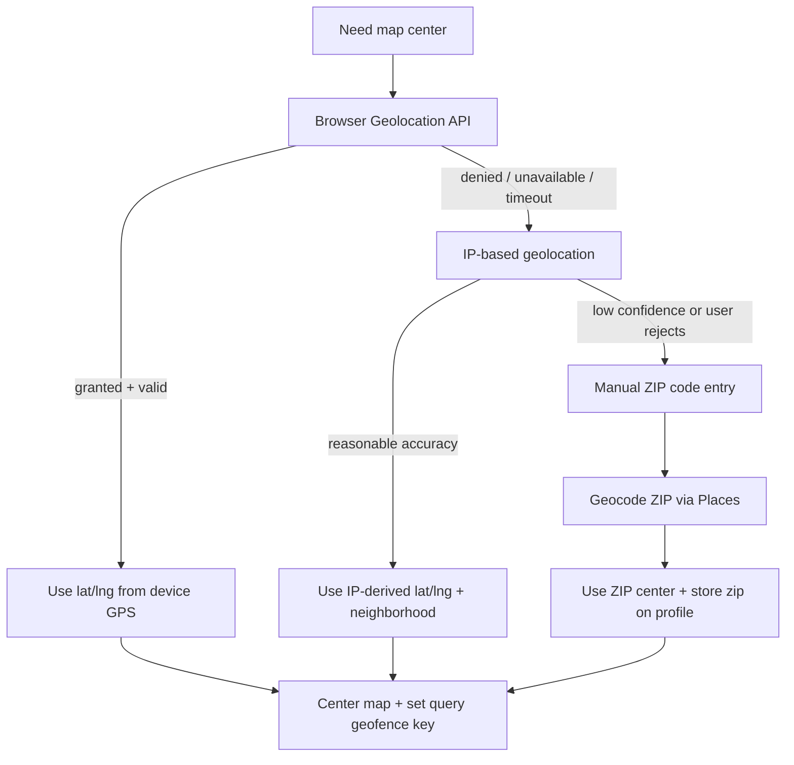

# GoodNeightbor - project plan

Architecture and implementation phases for the AWS Hackathon 2026 GoodNeightbor app.

## Auth flow

Primary sign-in is **Google OAuth** via Cognito (federated identity). Email/password remains available as a secondary path.



| Step | Route | Behavior |
|------|-------|----------|
| 1 | `app/page.tsx` | Logo, tagline, CTA **Sign in** → `/login` |
| 2 | `app/(auth)/login/page.tsx` | **Continue with Google** (primary); email sign-in + create account (secondary) |
| 3 | After auth | Cognito session (JWT); `GET /profiles/me` → create/update profile in DynamoDB |
| 4 | Location | Resolve map center (see [Location resolution](#location-resolution)); store neighborhood/ZIP on profile when known |
| 5 | Redirect | Authenticated → `/map` centered on resolved location; middleware blocks guests |

| Store | What |
|-------|------|
| **Cognito** | Credentials or Google federated identity, `sub`, email, name (from Google when used) |
| **Google Cloud** | OAuth client (Web) — redirect URIs match Cognito Hosted UI / app callback |
| **DynamoDB** | `USER#<sub>` / `PROFILE` — email, displayName, neighborhood, zipCode, lat/lng (private, for map center), createdAt |

### Google OAuth setup

| Piece | Responsibility |
|-------|----------------|
| Google Cloud Console | OAuth 2.0 client (Web application); authorized redirect URIs for Cognito |
| Cognito User Pool | Google identity provider; attribute mapping (email, name, `sub`) |
| Amplify Auth | `signInWithRedirect` / Hosted UI for Google; secrets via `ampx sandbox secret set` |
| App | Prominent **Continue with Google** on `/login`; handle callback and session refresh |

## Product (MVP)

1. Landing → login page  
2. Sign in with **Google** (primary) or email (Cognito); profile in DynamoDB  
3. Map home: left ~50% map centered on **user-resolved location** (no fixed demo geofence)  
4. Create assistance request + **obfuscated** pin on map (approximate area only — see [Location privacy](#location-privacy))  
5. See others' pins with author (public area only); respond to requests  
6. Requester **accepts** one helper's offer → private thread opens to confirm pickup/meet-up details  
7. Optional **meeting place** hint on the request (public, vague); exact address only in private chat after acceptance  
8. **Neighborhood leaderboard** on the bottom half of `/map`: requests completed and hours contributed, scoped to the viewer’s neighborhood, toggle **All time** / **This week**  

## Map screen layout

`/map` uses a vertical split: **top ~50%** for map + request list (side by side on large screens), **bottom ~50%** for the neighborhood leaderboard. Changing the user’s resolved neighborhood (GPS / ZIP / **Change location**) refetches leaderboard data for that geofence.

```
┌──────────────── Map (~25%) ────────────────┬── Requests (~25%) ──┐  top 50%
├──────────────── Leaderboard (full width) ─────────────────────────┤  bottom 50%
│  Capitol Hill · [ All time ▼ ]                                    │
│  Rank  Name              Requests    Hours                          │
└───────────────────────────────────────────────────────────────────┘
```

## Leaderboard

Track neighbor contributions per **neighborhood** (same geofence key as requests). Rank by helpful activity so takers are encouraged to give back.

| Metric | All time | This week |
|--------|----------|-----------|
| **Requests completed** | Count of fulfilled helps (helper or requester role, per product rule) | Same, filtered to ISO week of `fulfilledAt` |
| **Hours contributed** | Sum of logged duration on fulfilled requests | Sum for current calendar week (UTC or US-Pacific — pick one in Phase 6) |

| UX | Detail |
|----|--------|
| Placement | Bottom half of `/map`, always visible on the home screen |
| Period toggle | Dropdown: **All time** \| **This week** — client passes `period=all` or `period=week` to API |
| Neighborhood scope | Leaderboard title shows active neighborhood label; updates when user changes location or profile geofence |
| Sort | Primary: hours contributed (desc), tie-break: requests completed (desc) |
| Hours source | Set when a request is marked `fulfilled` (helper reports or requester confirms duration in thread — MVP: single `hoursContributed` number on fulfill) |
| Privacy | Display names only; no exact addresses on leaderboard |



## Location privacy

Public surfaces never expose exact home coordinates. Behavior is modeled on **Facebook Marketplace**–style area pins: neighbors see *roughly where* help is needed, not a doxxable address.

| Layer | Stored / used internally | Shown publicly |
|-------|--------------------------|----------------|
| User map center | GPS / IP / ZIP (full resolution for queries) | Neighborhood or ZIP label only; map centers on bucket, not exact home |
| Request pin | True lat/lng (server-side, encrypted at rest) | **Obfuscated point**: random offset within a fixed-radius buffer (~0.25–0.5 mi / ~400–800 m) around the true location; same request always maps to the same public point (deterministic jitter from `requestId`) |
| Meeting place | Optional free-text or Places search at create time | Public label only (e.g. "near Safeway on Broadway") — no street number unless user chooses a public landmark |
| Exact address / door code | — | **Never** on map, list, or API fields returned to non-participants |



| UX | Detail |
|----|--------|
| Pin appearance | Circle or fuzzy radius on map (buffer zone), not a precise rooftop marker |
| Create flow | User picks area on map or search; copy explains the public pin will be approximate |
| Meeting place | Optional field: "Where should we meet?" — shown on card; still vague publicly |
| After acceptance | Requester and accepted helper get a **private chat** to agree on exact location, time, and contact |
| Other responders | Not in the thread; request closes or marks other offers declined when one is accepted |

**MVP rule:** Exact coordinates and full addresses exist only in DynamoDB fields omitted from public `GET /requests` and are writable only via the private thread after a match is accepted.

## Location resolution

On first visit (and when location is stale or wrong), resolve where to center the map and which neighborhood bucket to use for queries.



| Priority | Source | Behavior |
|----------|--------|----------|
| 1 | **Device GPS** | `navigator.geolocation.getCurrentPosition` — prompt for location access; use coordinates when granted |
| 2 | **IP geolocation** | Server or client IP lookup (e.g. Amazon Location / third-party) when GPS denied or fails |
| 3 | **Manual ZIP** | User enters ZIP when IP is wrong or they want a different area; geocode to lat/lng and neighborhood label |

| UX | Detail |
|----|--------|
| Permission copy | Explain why location helps show nearby requests; GPS is used for *your* map center and queries, not published as your home pin |
| Wrong location | **Change location** → re-run GPS, or enter ZIP |
| Privacy | Profile and browse APIs expose neighborhood/ZIP only; [Location privacy](#location-privacy) governs request pins |
| Map default | **No** hardcoded Capitol Hill or other demo geofence — always user-derived |

Resolution uses full accuracy **internally** (geofence queries, obfuscation seed). Anything returned to other users is [obfuscated](#location-privacy).

## Stack

| Layer | Choice |
|-------|--------|
| Frontend | Next.js App Router + TypeScript + Tailwind |
| Auth | Cognito + **Google OAuth (primary)** + email |
| API | Lambda + HTTP API + Cognito JWT authorizer |
| Data | DynamoDB single-table + GSI by geofence |
| Maps | Amazon Location Service (map, Places, IP geolocation) |
| Hosting | Amplify Hosting |

## UI routes

```
app/
├── page.tsx                 # Landing → /login
├── (auth)/login/page.tsx    # Sign in + sign up
└── (main)/map/page.tsx      # Top: map + requests; bottom: leaderboard (Phase 6)
    └── requests/[id]/thread  # Private chat after offer accepted (Phase 5)
components/
└── LeaderboardPanel.tsx     # Period dropdown + neighborhood-scoped table
```

## DynamoDB model

| Entity | PK | SK | GSI1 | Notes |
|--------|----|----|------|-------|
| Profile | `USER#<sub>` | `PROFILE` | — | Private lat/lng for map center; public neighborhood/ZIP only |
| HelpRequest | `REQUEST#<id>` | `METADATA` | `GEOFENCE#<neighborhood-or-zip>` / `STATUS#OPEN#<ts>` | `trueLat`/`trueLng` (private); `publicLat`/`publicLng` (derived); optional `meetingPlaceLabel` |
| Response | `REQUEST#<id>` | `RESPONSE#<responderSub>` | — | Status: `pending` \| `accepted` \| `declined` |
| Thread | `REQUEST#<id>` | `THREAD#<acceptedSub>` | — | Private messages; exact location / meet-up details after acceptance |
| Message | `REQUEST#<id>` | `MSG#<ts>#<id>` | — | Belongs to accepted requester ↔ helper pair only |
| LeaderboardEntry | `GEOFENCE#<neighborhood>` | `LEADER#ALL#<sub>` | `LEADERBOARD#<nh>#ALL#<hours>` | `requestsCompleted`, `hoursContributed`, `displayName` |
| LeaderboardEntry (week) | `GEOFENCE#<neighborhood>` | `LEADER#WEEK#<isoWeek>#<sub>` | `LEADERBOARD#<nh>#WEEK#<isoWeek>#<hours>` | Reset each ISO week; same metrics |

## Lambda API

| Method | Path | Visibility |
|--------|------|------------|
| GET | `/profiles/me` | Owner |
| PUT | `/profiles/me` | Owner |
| GET | `/requests` | Public fields only (obfuscated pin, meeting place label) |
| POST | `/requests` | Creates request; server derives public pin from true location |
| POST | `/requests/:id/respond` | Creates pending offer |
| POST | `/requests/:id/responses/:responseId/accept` | Requester accepts one helper; opens thread |
| GET | `/requests/:id/thread` | Participants only (accepted requester + helper) |
| POST | `/requests/:id/thread/messages` | Participants only — exact address / coordination |
| GET | `/leaderboard?neighborhood=<id>&period=all\|week` | Authenticated; returns ranked rows for geofence + period |

Map center and zoom come from [Location resolution](#location-resolution) (GPS → IP → ZIP), not a fixed demo coordinate. Leaderboard `neighborhood` matches the active geofence key from profile or **Change location**.

Query params:

| Param | Values | Default |
|-------|--------|---------|
| `neighborhood` | Geofence id (e.g. ZIP or neighborhood slug) | Required |
| `period` | `all` \| `week` | `all` |

## Implementation phases

The brainstorm points toward a neighborhood mutual-aid marketplace: people post
items, resources, requests, or local events; neighbors browse by map, cards, or
list; and contribution history encourages takers to give back.

### Phase 0 - Product framing and repo baseline

**Goal:** Turn the "Commons / In Common" idea into a focused demo scope.

| Area | Services incorporated |
|------|-----------------------|
| AWS services | IAM for project admins/developers; no app infrastructure deployed yet |
| Other services/tools | Git/GitHub, Next.js App Router, TypeScript, Tailwind, local browser testing |

Deliverables:

- Confirm the MVP loop: sign in, post a give/request item, browse nearby posts
  (obfuscated pins), respond, requester accepts one offer, private chat to confirm
  location, earn reputation.
- Keep IAM scoped to AWS operators only; app users are not IAM users.
- Maintain the current landing, login, and map stubs as the demo shell.
- No default geofence; location is user-resolved at runtime.

Status: Done for the current scaffold.

### Phase 1 - Identity, roles, and user profiles

**Goal:** Let residents sign up, sign in, and receive an app profile.

| Area | Services incorporated |
|------|-----------------------|
| AWS services | Amazon Cognito User Pool, Cognito Hosted UI, IAM roles/policies, DynamoDB profile items |
| Other services/tools | Google OAuth provider, Amplify client libraries, Next.js middleware/session helpers |

Deliverables:

- **Google sign-in** as the primary path (Cognito federated identity + Amplify Auth).
- Email sign-up/sign-in through Cognito as secondary.
- Google OAuth client + Cognito IdP configuration (redirect URIs, secrets).
- Profile creation/update in DynamoDB after first login (including name/email from Google).
- User attributes for display name, email, role, neighborhood, and zipCode.
- Role distinction between resident, neighborhood moderator, and app admin.

### Phase 2 - Hosted website and navigation shell

**Goal:** Make the app usable as a deployed web experience.

| Area | Services incorporated |
|------|-----------------------|
| AWS services | AWS Amplify Hosting, managed CloudFront distribution, S3-backed static assets |
| Other services/tools | Next.js routes, responsive UI components, Tailwind, environment configuration |

Deliverables:

- Deployed landing page for GoodNeightbor.
- Protected `/map` route for authenticated users.
- Map/cards/list navigation model from the brainstorm.
- Clear empty/loading/error states for the demo.

### Phase 3 - Core posts, requests, and item sharing

**Goal:** Build the mutual-aid marketplace loop.

| Area | Services incorporated |
|------|-----------------------|
| AWS services | DynamoDB single-table data model, Lambda, HTTP API / API Gateway, Cognito JWT authorizer, IAM execution roles |
| Other services/tools | API client, request validation, TypeScript domain models |

Deliverables:

- Create a post with title, description, category, type, status, and author.
- Support post types such as `give`, `need`, `borrow`, and `event`.
- Browse posts as cards/list before map work is complete.
- Store post status: open, claimed, fulfilled, expired.
- Add seed/demo data keyed by neighborhood/ZIP (not a single fixed geofence).

### Phase 4 - Location, geocoding, and neighborhood map

**Goal:** Make location the center of the product demo.

| Area | Services incorporated |
|------|-----------------------|
| AWS services | Amazon Location Service maps, Places/geocoding, reverse geocoding, IP geolocation, DynamoDB GSI by neighborhood/ZIP |
| Other services/tools | MapLibre GL or compatible map renderer, browser Geolocation API, ZIP entry UI, address privacy rules |

Deliverables:

- Implement [Location resolution](#location-resolution): GPS first, then IP, then manual ZIP.
- Center the map on the resolved user location (no Capitol Hill or other hardcoded default).
- **Change location** flow when GPS/IP is wrong (re-prompt GPS or enter ZIP).
- Geocode ZIP to lat/lng and neighborhood label; persist on profile.
- Let users drop or search for a location when creating a post (true location stored server-side).
- **Obfuscated public pins**: deterministic jitter within buffer radius; fuzzy circle on map (see [Location privacy](#location-privacy)).
- Optional **meeting place** label on create (public, vague).
- Browse nearby posts as obfuscated map pins and synchronized list/cards (filter by user's neighborhood/ZIP bucket).
- Public `GET /requests` never returns `trueLat`/`trueLng`.

### Phase 5 - Responses, acceptance, and private coordination

**Goal:** Let neighbors act on posts and confirm exact meet-up details only after a trusted match.

| Area | Services incorporated |
|------|-----------------------|
| AWS services | Lambda response/accept/thread endpoints, API Gateway, DynamoDB response/thread/message items, Cognito authorizer |
| Other services/tools | In-app response UI, private thread UI, notification copy, moderation rules |

Deliverables:

- Respond to a request or claim an offered item (offer status `pending`).
- **Accept offer**: requester chooses one helper → status `accepted`, others `declined`; request moves to `claimed`.
- **Private thread** between requester and accepted helper only — confirm exact address, time, and meet-up (not visible on map or to other responders).
- Show post author and response list to requester; helpers see only their own offer state until accepted.
- Prevent users from responding to their own posts where inappropriate.
- Add basic moderation affordances for neighborhood admins.

### Phase 6 - Reputation, reciprocity, and leaderboard

**Goal:** Address the brainstorm question: "How do you incentivize takers to give?" Surface contribution on the map home screen.

| Area | Services incorporated |
|------|-----------------------|
| AWS services | DynamoDB counters/transactions, leaderboard GSI, Lambda reputation + leaderboard handlers, CloudWatch metrics |
| Other services/tools | `LeaderboardPanel`, period dropdown, neighborhood refetch on location change |

Deliverables:

- On `fulfilled`, atomically increment `requestsCompleted` and `hoursContributed` for helper (and rules for requester if applicable) in **all-time** and **current-week** items per neighborhood.
- `GET /leaderboard?neighborhood=&period=all|week` — sorted list for [Leaderboard](#leaderboard) UI.
- **Bottom half of `/map`**: `LeaderboardPanel` with **All time** / **This week** dropdown; refetch when neighborhood changes.
- Columns: rank, display name, requests completed, hours contributed.
- Profile summary of own all-time + weekly stats (optional card above table).
- Keep scoring explainable; defer badges and anti-gaming beyond basic fulfill validation.

### Phase 7 - Demo readiness, observability, and cost controls

**Goal:** Make the AWS demo reliable, understandable, and affordable.

| Area | Services incorporated |
|------|-----------------------|
| AWS services | CloudWatch Logs, CloudWatch metrics, AWS Budgets, Amplify branch deploys, S3 lifecycle rules |
| Other services/tools | Demo script, smoke tests, accessibility checks, seed data scripts |

Deliverables:

- End-to-end demo script: login, create post (obfuscated pin + optional meeting place), browse map, respond, accept offer, private chat to confirm location, leaderboard update.
- CloudWatch logs for API and geofence failures.
- Budget alerts for the hackathon AWS account.
- Build/lint checks before demo.
- Explicitly defer RDS unless relational reporting becomes necessary; DynamoDB is the MVP data store. If RDS is introduced later, add a stop/start cost-control plan.

## Git workflow (team + agent)

Before every push to `origin/main`:

1. `git fetch origin`
2. `git pull --rebase origin main`
3. Resolve conflicts if any; continue rebase
4. `git push origin main`

Do not force-push `main` without explicit team approval.

## Future

Configurable per-neighborhood geofences (admin-drawn), continuous GPS updates, push notifications, rich chat (read receipts, images), adjustable obfuscation radius per neighborhood.
