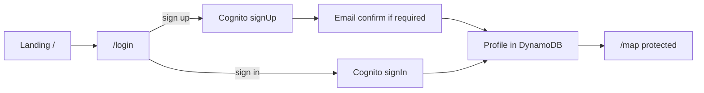

# Good Neighbor — project plan

Architecture and implementation phases for the AWS Hackathon 2026 Good Neighbor app.

## Auth flow



| Step | Route | Behavior |
|------|-------|----------|
| 1 | `app/page.tsx` | Logo, tagline, CTA **Sign in** → `/login` |
| 2 | `app/(auth)/login/page.tsx` | Sign in + create account (Cognito); Google when configured |
| 3 | After auth | `GET /profiles/me` → create/update profile in DynamoDB |
| 4 | Redirect | Authenticated → `/map`; middleware blocks guests |

| Store | What |
|-------|------|
| **Cognito** | Credentials, `sub`, email |
| **DynamoDB** | `USER#<sub>` / `PROFILE` — email, displayName, createdAt |

## Product (MVP)

1. Landing → login page  
2. Sign up / sign in (Cognito); profile in DynamoDB  
3. Map home: left ~50% map (Capitol Hill default)  
4. Create assistance request + pin on map  
5. Pin must be inside `capitol-hill` geofence (Location Service)  
6. See others' pins with author; respond to requests  

## Stack

| Layer | Choice |
|-------|--------|
| Frontend | Next.js App Router + TypeScript + Tailwind |
| Auth | Cognito + email + Google OAuth |
| API | Lambda + HTTP API + Cognito JWT authorizer |
| Data | DynamoDB single-table + GSI by geofence |
| Maps | Amazon Location Service (map + geofence) |
| Hosting | Amplify Hosting |

## UI routes

```
app/
├── page.tsx                 # Landing → /login
├── (auth)/login/page.tsx    # Sign in + sign up
└── (main)/map/page.tsx      # Split map (protected)
```

## DynamoDB model

| Entity | PK | SK | GSI1 |
|--------|----|----|------|
| Profile | `USER#<sub>` | `PROFILE` | — |
| HelpRequest | `REQUEST#<id>` | `METADATA` | `GEOFENCE#capitol-hill` / `STATUS#OPEN#<ts>` |

## Lambda API

| Method | Path |
|--------|------|
| GET | `/profiles/me` |
| PUT | `/profiles/me` |
| GET | `/requests` |
| POST | `/requests` |
| POST | `/requests/:id/respond` |

Capitol Hill center: `47.6253`, `-122.3222`, zoom `14`.

## Phases

### Phase 0 — Done

README, docs, .gitignore, Next.js stubs, no AWS deploy.

### Phase 1 — Full scaffold + AWS

Amplify Gen 2: auth, DynamoDB, Location, Lambda, API Gateway, Cognito UI, middleware.

### Phase 2 — MVP features

Create/list pins, geofence validation, respond flow, polish.

## Git workflow (team + agent)

Before every push to `origin/main`:

1. `git fetch origin`
2. `git pull --rebase origin main`
3. Resolve conflicts if any; continue rebase
4. `git push origin main`

Do not force-push `main` without explicit team approval.

## Future

Per-user geofences, live GPS, notifications, chat.
