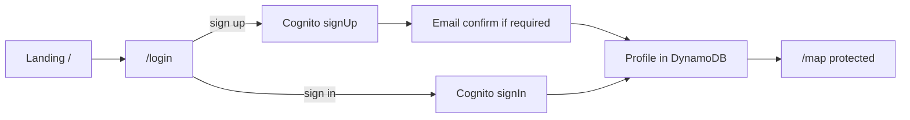

# GoodNeightbor - project plan

Architecture and implementation phases for the AWS Hackathon 2026 GoodNeightbor app.

## Auth flow



| Step | Route | Behavior |
|------|-------|----------|
| 1 | `app/page.tsx` | Logo, tagline, CTA **Sign in** → `/login` |
| 2 | `app/(auth)/login/page.tsx` | Sign in + create account (Cognito); Google when configured |
| 3 | After auth | `GET /profiles/me` → create/update profile in DynamoDB |
| 4 | Redirect | Authenticated → `/map`; middleware blocks guests |

| Store | What |
|-------|------|
| **Cognito** | Credentials, `sub`, email |
| **DynamoDB** | `USER#<sub>` / `PROFILE` — email, displayName, createdAt |

## Product (MVP)

1. Landing → login page  
2. Sign up / sign in (Cognito); profile in DynamoDB  
3. Map home: left ~50% map (Capitol Hill default)  
4. Create assistance request + pin on map  
5. Pin must be inside `capitol-hill` geofence (Location Service)  
6. See others' pins with author; respond to requests  

## Stack

| Layer | Choice |
|-------|--------|
| Frontend | Next.js App Router + TypeScript + Tailwind |
| Auth | Cognito + email + Google OAuth |
| API | Lambda + HTTP API + Cognito JWT authorizer |
| Data | DynamoDB single-table + GSI by geofence |
| Maps | Amazon Location Service (map + geofence) |
| Hosting | Amplify Hosting |

## UI routes

```
app/
├── page.tsx                 # Landing → /login
├── (auth)/login/page.tsx    # Sign in + sign up
└── (main)/map/page.tsx      # Split map (protected)
```

## DynamoDB model

| Entity | PK | SK | GSI1 |
|--------|----|----|------|
| Profile | `USER#<sub>` | `PROFILE` | — |
| HelpRequest | `REQUEST#<id>` | `METADATA` | `GEOFENCE#capitol-hill` / `STATUS#OPEN#<ts>` |

## Lambda API

| Method | Path |
|--------|------|
| GET | `/profiles/me` |
| PUT | `/profiles/me` |
| GET | `/requests` |
| POST | `/requests` |
| POST | `/requests/:id/respond` |

Capitol Hill center: `47.6253`, `-122.3222`, zoom `14`.

## Implementation phases

The brainstorm points toward a neighborhood mutual-aid marketplace: people post
items, resources, requests, or local events; neighbors browse by map, cards, or
list; and contribution history encourages takers to give back.

### Phase 0 - Product framing and repo baseline

**Goal:** Turn the "Commons / In Common" idea into a focused demo scope.

| Area | Services incorporated |
|------|-----------------------|
| AWS services | IAM for project admins/developers; no app infrastructure deployed yet |
| Other services/tools | Git/GitHub, Next.js App Router, TypeScript, Tailwind, local browser testing |

Deliverables:

- Confirm the MVP loop: sign in, post a give/request item, browse nearby posts,
  respond or claim, earn reputation.
- Keep IAM scoped to AWS operators only; app users are not IAM users.
- Maintain the current landing, login, and map stubs as the demo shell.
- Decide the initial neighborhood demo area: `capitol-hill`.

Status: Done for the current scaffold.

### Phase 1 - Identity, roles, and user profiles

**Goal:** Let residents sign up, sign in, and receive an app profile.

| Area | Services incorporated |
|------|-----------------------|
| AWS services | Amazon Cognito User Pool, Cognito Hosted UI, IAM roles/policies, DynamoDB profile items |
| Other services/tools | Google OAuth provider, Amplify client libraries, Next.js middleware/session helpers |

Deliverables:

- Email sign-up/sign-in through Cognito.
- Optional Google OAuth once credentials are configured.
- Profile creation/update in DynamoDB after first login.
- User attributes for display name, email, role, and neighborhood.
- Role distinction between resident, neighborhood moderator, and app admin.

### Phase 2 - Hosted website and navigation shell

**Goal:** Make the app usable as a deployed web experience.

| Area | Services incorporated |
|------|-----------------------|
| AWS services | AWS Amplify Hosting, managed CloudFront distribution, S3-backed static assets |
| Other services/tools | Next.js routes, responsive UI components, Tailwind, environment configuration |

Deliverables:

- Deployed landing page for GoodNeightbor.
- Protected `/map` route for authenticated users.
- Map/cards/list navigation model from the brainstorm.
- Clear empty/loading/error states for the demo.

### Phase 3 - Core posts, requests, and item sharing

**Goal:** Build the mutual-aid marketplace loop.

| Area | Services incorporated |
|------|-----------------------|
| AWS services | DynamoDB single-table data model, Lambda, HTTP API / API Gateway, Cognito JWT authorizer, IAM execution roles |
| Other services/tools | API client, request validation, TypeScript domain models |

Deliverables:

- Create a post with title, description, category, type, status, and author.
- Support post types such as `give`, `need`, `borrow`, and `event`.
- Browse posts as cards/list before map work is complete.
- Store post status: open, claimed, fulfilled, expired.
- Add seed/demo data for Capitol Hill.

### Phase 4 - Location, geocoding, and neighborhood map

**Goal:** Make location the center of the product demo.

| Area | Services incorporated |
|------|-----------------------|
| AWS services | Amazon Location Service maps, Places/geocoding, reverse geocoding, geofences, DynamoDB GSI by geofence |
| Other services/tools | MapLibre GL or compatible map renderer, browser geolocation API, address privacy rules |

Deliverables:

- Render the Capitol Hill map centered at `47.6253`, `-122.3222`.
- Let users drop or search for a location when creating a post.
- Translate coordinates into a street address or approximate neighborhood label.
- Validate that new pins fall inside the `capitol-hill` geofence.
- Browse nearby posts as map pins and synchronized list/cards.

### Phase 5 - Responses, claims, and lightweight coordination

**Goal:** Let neighbors act on posts without building a full chat system first.

| Area | Services incorporated |
|------|-----------------------|
| AWS services | Lambda response endpoints, API Gateway, DynamoDB response/claim items, Cognito authorizer |
| Other services/tools | In-app response UI, notification copy, moderation rules |

Deliverables:

- Respond to a request or claim an offered item.
- Show post author, responder, and response history.
- Prevent users from responding to their own posts where inappropriate.
- Add basic moderation affordances for neighborhood admins.

### Phase 6 - Reputation, reciprocity, and leaderboard

**Goal:** Address the brainstorm question: "How do you incentivize takers to give?"

| Area | Services incorporated |
|------|-----------------------|
| AWS services | DynamoDB counters/transactions, leaderboard GSI, Lambda reputation service, CloudWatch metrics |
| Other services/tools | Reputation rules, badges, anti-gaming checks, admin review workflow |

Deliverables:

- Award points for fulfilled gives, helpful responses, and verified contributions.
- Show a neighborhood leaderboard or contribution summary.
- Add profile reputation totals and recent activity.
- Keep scoring explainable and lightweight for the hackathon demo.

### Phase 7 - Demo readiness, observability, and cost controls

**Goal:** Make the AWS demo reliable, understandable, and affordable.

| Area | Services incorporated |
|------|-----------------------|
| AWS services | CloudWatch Logs, CloudWatch metrics, AWS Budgets, Amplify branch deploys, S3 lifecycle rules |
| Other services/tools | Demo script, smoke tests, accessibility checks, seed data scripts |

Deliverables:

- End-to-end demo script: login, create post, map pin, respond, leaderboard update.
- CloudWatch logs for API and geofence failures.
- Budget alerts for the hackathon AWS account.
- Build/lint checks before demo.
- Explicitly defer RDS unless relational reporting becomes necessary; DynamoDB is the MVP data store. If RDS is introduced later, add a stop/start cost-control plan.

## Git workflow (team + agent)

Before every push to `origin/main`:

1. `git fetch origin`
2. `git pull --rebase origin main`
3. Resolve conflicts if any; continue rebase
4. `git push origin main`

Do not force-push `main` without explicit team approval.

## Future

Per-user geofences, live GPS, notifications, chat.
